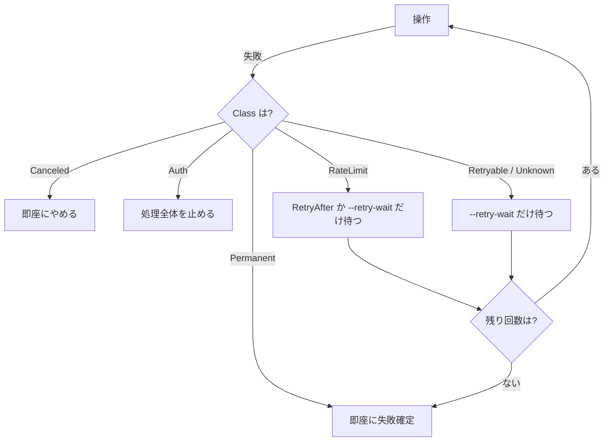

# 失敗の分類

「待てば直るのか、直らないのか」をどう決めているかです。

## なぜ分類するのか

分類しないと、次のどちらかが起きます。

- 待っても直らないもの（存在しない・権限がない）を3回×5秒待って諦める
- 一時的なもの（瞬断・5xx）を1回で諦める

どちらも利用者にとって困ります。前者は無駄に待たされ、後者は本当なら
成功したはずの転送が失敗として残ります。

## 分類はバックエンドの中で行う

**転送エンジンは SDK ごとのエラー型を知りません。** `errors.As` で
`*storage.OpError` を取り出すだけです。


新しいバックエンドを足すとき、転送エンジン側を触る必要はありません。

## `storage.Class`

| 値 | 意味 | 再試行 | 例 |
| --- | --- | --- | --- |
| `ClassPermanent` | 待っても直らない | しない | 404、権限がない、パスが不正、容量が足りない |
| `ClassRetryable` | 一時的 | する | 瞬断、5xx、接続が切れた |
| `ClassRateLimit` | 要求が多すぎる | 待ってからする | 429、Dropbox の `too_many_write_operations` |
| `ClassAuth` | 認証・認可の失敗 | しない。**処理全体を止める** | 401、トークンが失効した |
| `ClassCanceled` | 取り消された | しない | Ctrl-C |
| `ClassUnknown` | 分類できない | する（保守的に） | 見覚えのないもの |

`ClassUnknown` を再試行の対象にしているのは、分からないものを
「直らない」と決めつけないためです。

## `storage.OpError`

```go
type OpError struct {
    Op         string        // "list", "open", "put" など
    Storage    string        // ストレージの名前
    Path       string
    Class      Class
    RetryAfter time.Duration // サーバーが待ち時間を指示した場合
    Err        error
}
```

`RetryAfter` があるときは、`--retry-wait` より優先します。
サーバーの指示を無視して連打すると逆効果になるためです。

## 番兵エラー

`errors.Is` で判定します。

| 値 | 意味 |
| --- | --- |
| `ErrNotFound` | 対象が存在しない |
| `ErrIsDir` | ファイルを期待した場所がディレクトリだった |
| `ErrNotDir` | ディレクトリを期待した場所がファイルだった |
| `ErrExist` | すでに存在する |
| `ErrNotEmpty` | ディレクトリが空でない |
| `ErrUnsupported` | そのストレージが対応していない操作 |

包むときは**元のエラーも失いません**。

```go
err = fmt.Errorf("%w (%w)", sentinel, err)
```

`errors.Is(err, storage.ErrNotFound)` でも判定でき、表示すれば元の
メッセージも読める、という形です。

## バックエンドごとの見分け方

どのパッケージも `errors.go` に `classify(err) verdict` を持ちます。

```go
type verdict struct {
    sentinel error         // 対応する番兵エラー。なければ nil
    class    storage.Class
}
```

| バックエンド | 何を見るか |
| --- | --- |
| local | `os.ErrNotExist` など標準のエラー |
| dropbox | HTTP の状態コード + `error_summary`（`path/not_found/...`） |
| googledrive | `googleapi.Error` の `Code` と `reason` |
| onedrive | HTTP の状態コード + Graph の `code` |
| s3 | HTTP の状態コード + S3 の `Code` |
| sftp | `sftp.StatusError` の番号（SSH_FX_*） |
| smb | NTSTATUS の名前（`STATUS_ACCESS_DENIED` など） |
| webdav | HTTP の状態コード |
| ftp | FTP の3桁の番号 |

### 見分けにくいもの

**Google Drive の 403** は、権限の問題と流量制限の両方に使われます。
`reason` を見ないと、待てば直るのかどうかが分かりません。

```go
case "rateLimitExceeded", "userRateLimitExceeded":  → ClassRateLimit
case "storageQuotaExceeded", "quotaExceeded":       → ClassPermanent（容量不足）
case "insufficientFilePermissions":                 → ClassAuth
```

**SFTP の SSH_FX_FAILURE（4）** は、version 3 では容量不足も名前の衝突も
空でないディレクトリもすべてこれになります。決めつけずに
`ClassUnknown` として扱っています。

**S3 の SlowDown** は 503 で返ってきます。5xx として再試行するのではなく、
`ClassRateLimit` として待ちます。

**Dropbox のエラー型** は経路ごとに生成されており、`dropbox.APIError` を
埋め込んでいますが `errors.As` では取り出せません。リフレクションで
埋め込みを直接見ています（[backends.md](backends.md) 参照）。

## 再試行の流れ



`--retry-backoff` を指定しない限り、利用者向けの待ち時間は**固定間隔**です。
指数的に伸ばすのは、バックエンド内部の層の仕事です。

## 試験

失敗の分類は、偽サーバーから狙った失敗を返させて確かめています。

```go
f.failNext("get_metadata", 100, 429, `{"error_summary":"too_many_requests/.",...}`)

_, err := s.Stat(ctx, "/どこか.txt")
if class := storage.ClassOf(err); class != storage.ClassRateLimit {
    t.Errorf("失敗の種類 = %v, want ratelimit", class)
}
```

分類の表そのものも、表としてテストに書き下してあります。

---

[リバース資料の目次へ戻る](README.md)
