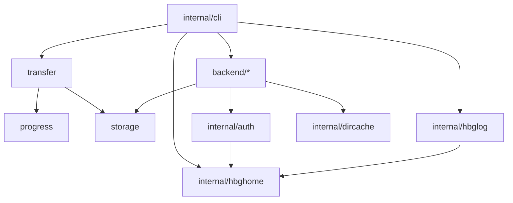

# フォルダ構成

## 全体

```
hbg/
├── cmd/hbg/              実行ファイルの入口
├── storage/              ストレージの抽象
│   └── storagetest/      適合性スイート
├── backend/              ストレージごとの実装
│   ├── local/            ローカルファイルシステム
│   ├── memory/           試験用のインメモリ
│   ├── dropbox/          Dropbox
│   ├── googledrive/      Google Drive
│   ├── onedrive/         OneDrive
│   ├── s3/               S3 互換
│   ├── sftp/             SFTP
│   ├── smb/              SMB
│   ├── webdav/           WebDAV
│   └── ftp/              FTP
├── transfer/             転送エンジン
├── progress/             進みぐあいの表示
├── internal/
│   ├── cli/              コマンドの定義
│   ├── auth/             OAuth の共通部分
│   ├── hbghome/          $HOME/hbg の置き場所
│   ├── hbglog/           ログ
│   └── dircache/         用意済みディレクトリの記憶
└── documents/            資料
```

## 依存の向き



**`storage` は何にも依存しません。** ここが要です。ストレージの抽象が
転送エンジンや CLI を知らないので、バックエンドを足しても上の層に
影響しません。

`backend/*` どうしも依存し合いません。`internal/cli` が blank import で
まとめて読み込むだけです。

## 各パッケージ

### `cmd/hbg`

`internal/cli.Execute()` を呼んで、その戻り値で `os.Exit` するだけです。

### `storage`

| ファイル | 内容 |
| --- | --- |
| `storage.go` | `Storage` インターフェースと `Features` |
| `optional.go` | できたりできなかったりする能力のインターフェース |
| `errors.go` | 番兵エラーと `Class`、`OpError` |
| `helpers.go` | `Copy`・`Move`・`PurgeAll` など、型アサーションを閉じ込めたもの |
| `hash.go` | ハッシュの種類と、Dropbox 独自ハッシュの実装 |

### `storage/storagetest`

適合性スイート。20の試験群があります。
新しいバックエンドはこれを通すのが受け入れの条件です。

### `backend/*`

どのパッケージもだいたい同じ形をしています。

| ファイル | 内容 |
| --- | --- |
| `<名前>.go` | `Storage` の実装 |
| `client.go` | 接続と設定 |
| `errors.go` | 失敗の分類 |
| `register.go` | 種別の登録と、設定ファイルの雛形 |
| `fake_test.go` | 試験用のサーバー |
| `<名前>_test.go` | 適合性スイートと、個別の試験 |

`backend/registry.go` が種別の一覧を、`backend/resolver.go` が
名前からの解決を受け持ちます。

### `transfer`

| ファイル | 内容 |
| --- | --- |
| `transfer.go` | `Options`・`Result`・`Run`・engine |
| `walk.go` | 走査。転送しながら次を探す |
| `worker.go` | 1ファイルの転送 |
| `compare.go` | 転送するかどうかの判断 |
| `filter.go` | 絞り込み |
| `delete.go` | 同期での削除 |
| `retry.go` | ファイル単位の再試行 |
| `pass.go` | 実行全体のやり直し |
| `limits.go` | 流量と帯域の制限 |

### `progress`

| ファイル | 内容 |
| --- | --- |
| `progress.go` | `Reporter` インターフェース |
| `bars.go` | 端末向け（mpb） |
| `plain.go` | 端末でない場合の行ログ |
| `human.go` | バイト数・速度・残り時間の表記 |
| `detect.go` | 端末かどうかの判定 |

**mpb は転送エンジンから見えません。** `transfer` は `progress.Reporter`
にしか依存せず、`progress` が実装を選びます。

### `internal/cli`

| ファイル | 内容 |
| --- | --- |
| `cmd.go` | 根のコマンド、終了コード、バックエンドの読み込み |
| `copy.go` | copy と sync の本体 |
| `sync.go` / `move.go` / `check.go` / `list.go` / `remove.go` | 各コマンド |
| `storages.go` | 設定からストレージの一覧を組み立てる |
| `config.go` / `config_cmd.go` | 設定ファイルの読み書き |
| `auth_cmd.go` | 認証 |
| `jsonout.go` | `--json` の出力 |
| `help.go` | ヘルプと雛形を、登録された内容から組み立てる |
| `shell.go` | 対話シェル |

## 命名の決まり

- 種別名は小文字（`googledrive`、`onedrive`）
- 設定ファイルの項目は snake_case（`app_key`、`strict_host_key_checking`）
- 書きかけの印は `.hbgpart`（どのバックエンドでも同じ）
- コメントは日本語。**何をしているか**ではなく**なぜそうしたか**を書く

---

[リバース資料の目次へ戻る](README.md)
