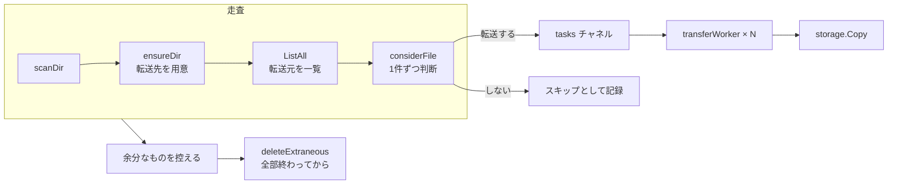
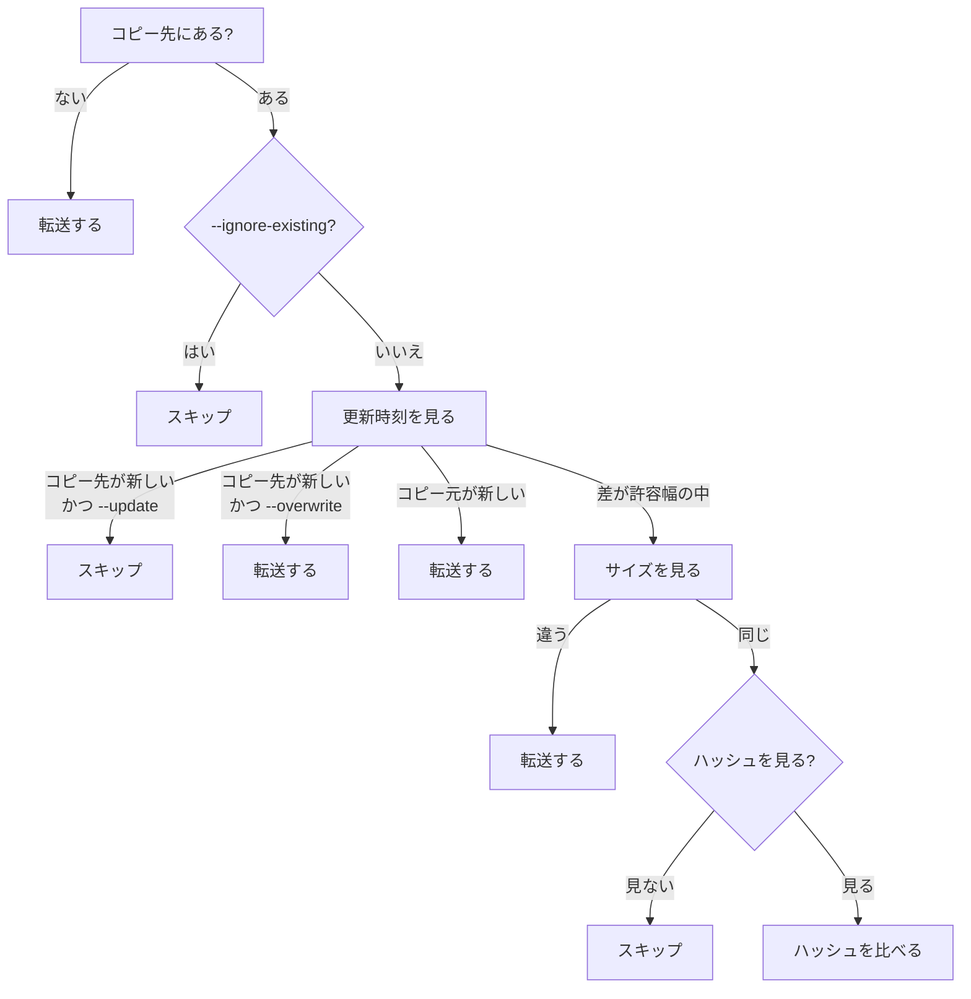

# 転送エンジン

`transfer` パッケージ。走査・比較・転送・再試行・削除を受け持ちます。

## 全体の流れ



**走査しながら転送を始めます。** 全件を溜めてから転送を始めるのではなく、
見つけたそばから流します。

保持するのは処理中のディレクトリ1つぶんのエントリと、`tasks` チャネルの
バッファだけなので、**件数が増えてもメモリは一定**です。

以前は全ジョブをメモリに溜め切ってから転送を始めていたため、大きな木では
数分間なにも表示されませんでした。

## 判断（`Comparer.Decide`）

1ファイルについて、転送するかどうかを決めます。



### 更新時刻をいちばん先に見る理由

「コピー先のほうが新しければ上書きしない」という指定は、サイズや内容が
違っていても守られるべきものです。サイズの比較を先に置くと、`--update` を
指定していてもサイズが違えば新しいファイルが古いもので上書きされます。

これは実際に起きていた不具合で、`transfer/compare_test.go` に
「コピー先のほうが新しく、サイズも違う（--update）」という名前で
回帰試験が入っています。

### 許容幅

`w = max(両側の ModTimePrecision, 1秒)` です。

Dropbox は秒までしか保持しないので、それより細かく比べても意味がありません。
FAT / exFAT は2秒刻みですが実行時に判別できないため、その上で使う場合は
`--modify-window 2s` を指定してもらいます。

### 起動時に断るもの

- ハッシュでの比較を求められたのに、共通して使えるハッシュがない
- 時刻での比較を求められたのに、コピー先が時刻を保持できない

どちらも黙って別の比較に落とさず、`NewComparer` がエラーを返します。

## 再試行

2段構えです。**役割が違う**ことに注意してください。

| 層 | 何を吸収するか | 利用者から見えるか |
| --- | --- | --- |
| バックエンド内（SDK の再試行など） | HTTP レベルの一時障害 | 見えない |
| `--retry` / `--retry-wait` | それでも失敗した1ファイル | 見える |
| `--retry-pass` / `--retry-pass-wait` | 実行全体をもう一度 | 見える |

### ファイル単位（`transfer/retry.go`）

`storage.Class` を尊重します。

- `ClassPermanent`（404・権限・パス不正）は**即座に失敗確定**。
  待っても直らないものを3回×5秒待って諦める、という無駄をしない
- `ClassCanceled`（Ctrl-C）は再試行しない
- `ClassAuth` は処理全体を止める
- `ClassRateLimit` は、サーバーが `Retry-After` を返していればそれを下限として使う

再試行が成立する前提は、**再試行の単位を「1ファイル転送」とし、毎回
`src.Open` からやり直す**ことです。以前は `Get` が返す `io.ReadCloser` を
一度しか使えず、そもそも書き込みを再試行できませんでした。

### 実行全体（`transfer/pass.go`）

まるごとやり直すわけではありません。差分の判断により、成功済みの
ファイルはスキップされて即座に飛ばされます。つまり実質「失敗分だけの
再実行」になります。

**進捗ゼロの回で打ち切ります。** 1件も転送できなかった場合、残り回数が
あってもそこで止めます。無限に繰り返さないためです。

## 削除（`transfer/delete.go`）

`sync --delete` のときだけ働きます。取り返しがつかないので、
判断に迷いのある場面では消しません。

| 決まり | 理由 |
| --- | --- |
| 転送に1件でも失敗があれば削除しない | 読めなかっただけで「向こうには無い」と判断すると、取っておきたいものを消す |
| 絞り込みで対象外にしたものは消さない | 転送していないものを消すのは筋が通らない |
| 一覧できなかったディレクトリの中身は消さない | 中身が分からないものを「コピー元にない」と判断できない |
| コピー元にないディレクトリは中をたどって1件ずつ控える | まるごと消すと、絞り込みで守ったはずのものまで巻き込む |
| 深いものから消す | ディレクトリは中身が無くならないと消せない |
| 転送がすべて終わってから消す | 途中で消すと、まだ判断していないものまで消しかねない |

規則はそのまま `transfer/delete_test.go` と `transfer/resilience_test.go` に
書き下してあります。

### 例外1: `--delete-on-partial`

「1件でも失敗があれば削除しない」は、件数が増えるほど窮屈になります。
50万件のミラーで1件も失敗しないという前提は成り立たず、そのたびに
削除が丸ごと止まると、消したはずのものが転送先に残り続けます。

`--delete-on-partial` を付けると、失敗があっても削除に進みます。
ただし**一覧できなかったディレクトリの中身は、この指定があっても消しません**。
これは特別扱いではなく、構造上そうなります ―― 削除対象を控えるのは
一覧に成功したあとなので、一覧できなかったディレクトリからは
そもそも何も控えられません。

### 例外2: 置き去りの `.hbgpart`

書き込み中の一時ファイルは、ふつうは転送の側が片付けます。しかし
強制終了や電源断では片付けられないまま転送先に残ります。

これは**絞り込みを通さずに削除します**。hbg 自身が作ったものであって
利用者のデータではないので、「転送していないものは消さない」という
決まりが当てはまらないためです。対象は**実行を始めた時刻より古いもの**
だけで、走っている最中に書かれたものには手を出しません。

## 流量と帯域の制限

```go
// transfer/limits.go
```

- `--tps`: 1秒あたりの API 呼び出し回数。**ストレージごと**に持ちます
- `--bwlimit`: 1秒あたりの転送バイト数

帯域の制限は**測定用の読み手の内側**に置きます。外側に置くと、
待っている時間が転送時間に混ざって速度が実際より速く見えます
（実測で10倍ずれていました）。

```go
// transfer/worker.go
Wrap: tracker.Wrap(e.bw.wrap(ctx, r))
```

## 進みぐあいの通知

`transfer` は `progress.Reporter` にしか依存しません。mpb は見えません。

```go
type Reporter interface {
    ScanStarted(); ScanProgress(dirs, files, bytes int64); ScanDone(...)
    StartFile(name string, size int64) FileTracker
    Skipped(name string, size int64)
    Logf(format string, a ...any)
    Done(res Summary); Close() error
}
```

`Logf` は進捗バーの上に出ます。以前は複数の goroutine から未同期に
`fmt.Printf` していたため、表示が混ざっていました。

`ScanDone` は走査の goroutine が終わった時点で呼びます。以前は転送が
すべて終わってから呼んでいたので、「調査中」が最後まで消えず、総量も
確定しないままでした。

### 数え方

進みぐあいの集計は `progress/stats.go` にまとめてあり、`Bars` と `Plain`
が共有します。

| 量 | 中身 |
| --- | --- |
| 見つけた量 | 走査で数えたぶん。転送と並行するので増えていく |
| 片付いた量 | 転送したぶん + 転送不要と判断したぶん + 読めずに諦めたぶん |
| 残りの量 | 見つけた量 − 片付いた量。これから転送するぶんにあたる |

全体バーは「片付いた量 / 見つけた量」です。**転送不要と判断したぶんを
片付いた側に入れるのが肝心**です。入れないと、すでにコピー済みのものが
多いときにバーがほとんど進まず、残り時間が実際の何倍にもなります。

速度と残り時間は、転送したぶんだけで求めます。片付いた量で割ると、
運んでいない量まで速度に化けます。残り時間は量から求めた値と件数から
求めた値の大きいほうを採ります。小さなファイルが大量にあるところでは、
時間を決めるのは量ではなく件数だからです。分母は経過時間そのものなので、
走査の待ちや判断にかかった時間も、そのまま見積もりに入ります。

読めずに諦めたぶんを片付いた側へ足すのは、失敗したファイルのぶんだけ
バーが最後まで届かなくなるのを防ぐためです。

### 描き方

- `PopCompletedMode` は使いません。終わったバーを端末に残す仕組みで、
  `BarRemoveOnComplete` より優先されるため、失敗や中断で止めたバーまで
  書きかけの姿のまま焼き付いていました。
- ファイルごとのバーは、始まってしばらく（`DefaultBarDelay`）経っても
  終わらないものにだけ出します。一瞬で終わるものにまで出すと、行数が
  描き直しのたびに増減して画面が落ち着きません。
- 名前は文字数ではなく表示幅で縮めます。日本語は1文字で2桁ぶんの幅を
  とるので、文字数で切ると行ごとに長さがそろいません。
- 全体バーの現在値は必ず集計から作り直して `SetCurrent` します。増分を
  足し込む形にすると、再試行で巻き戻すときに、同時に走っている他の
  ワーカーの進みぐあいまで消えてしまいます。
- ファイルごとの速度は `EwmaSpeed` です。全体の速度にこれを使うと、
  読み手ごとの所要時間を測るために同時処理数のぶんだけ過小に出ます。

## 終了コード

| コード | 意味 |
| --- | --- |
| 0 | 全件成功（0件だった場合も成功） |
| 1 | 実行そのものの失敗 |
| 2 | 引数や設定の誤り |
| 3 | 一部の転送に失敗 / 削除に失敗 / `check` で差分あり |
| 130 | Ctrl-C で中断 |

利用者が中断した場合は、処理中のものが偶然すべて終わっていても
中断として報告します。呼び出し側が終了コードを正しく決められるためです。

---

[リバース資料の目次へ戻る](README.md)
